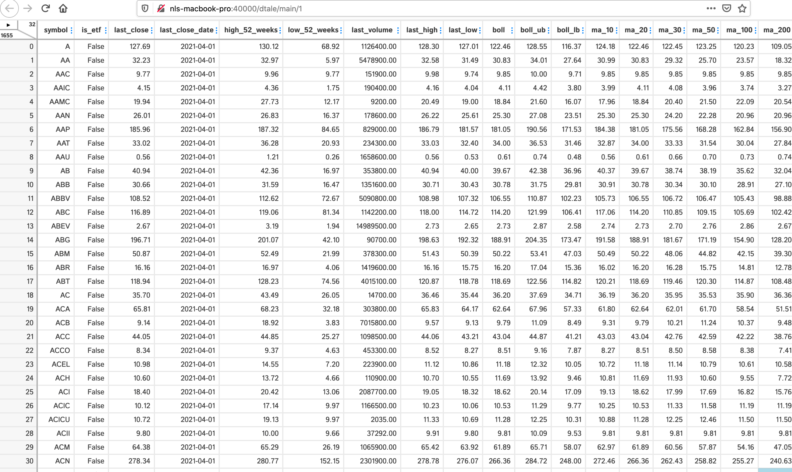
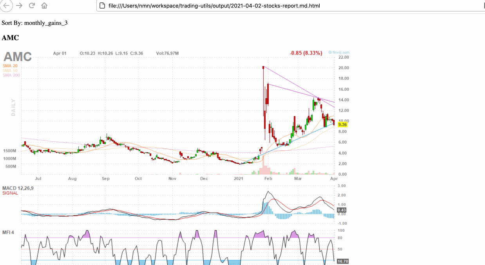
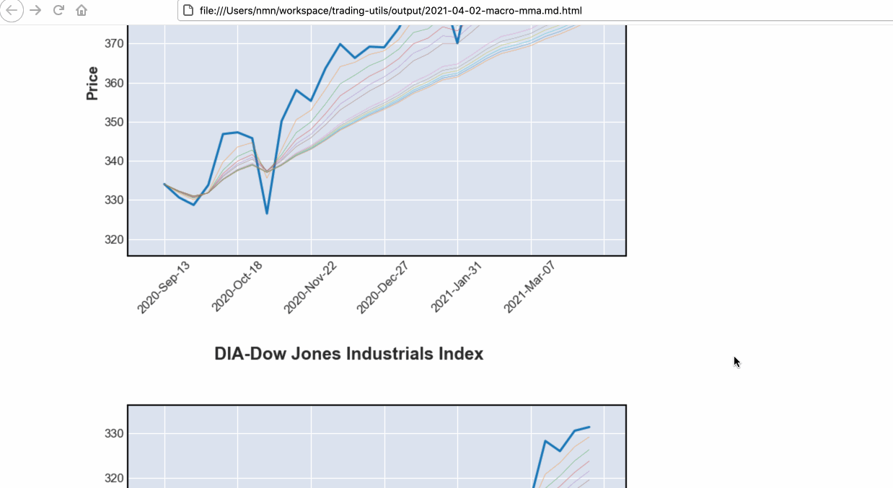
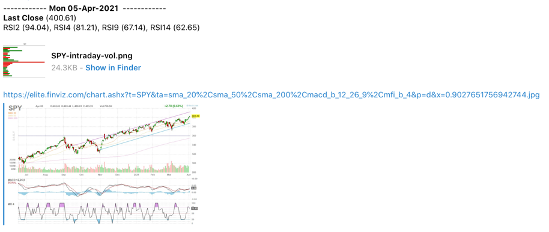
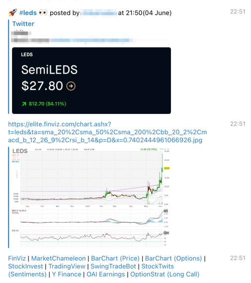
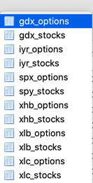
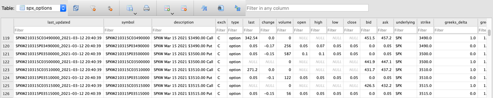
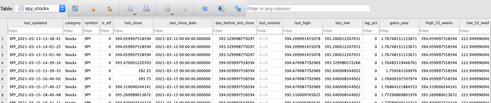

# Market Trading Analysis Utilities/Scripts

Collection of scripts and utilities for stock market analysis, strategies etc

## Online Tools

[VIX Implied Move Calculator](https://namuan.github.io/bin-utils/vix-implied-move.html)

[Loss Calculator](https://namuan.github.io/bin-utils/bet-loss-calculator.html)

[Profit Take](https://namuan.github.io/bin-utils/profit-take.html)

## Setup virtual environment

```shell
$ make setup
```

## Update dependencies

```shell
$ make deps
```

## Running scripts

All available scripts should provide a basic description and options to run appropriately

For eg.

```shell
$ ./venv/bin/python3 download_stocklist.py --help
```

I suggest setting up a quick alias to run the python version in the virtual environment. This will save you remembering
to activate the virtual environment. There are other options where you can override the `cd` command, but I find this
simple and transparent.

```
alias py=./venv/bin/python3
```

Now you can run the same script as

```shell
$ py download_stocklist.py --help
```

## Running your own scanner

As I usually run it over weekend, I've added a make command `weekend` to download the latest stocks and data and run
analysis on it. You can run it as

```shell
$ make weekend
```

Once the analysis is complete, it'll open up [DTale](https://pypi.org/project/dtale/) in your default browser.



## Reporting

Although it is possible to run queries in DTale, there is a way to generate report for a selected query. The generated
report contains the chart along with useful links to third party websites for more information.

You do need to setup [Pandoc](https://pandoc.org/installing.html) to generate HTML reports. If you are unable to install
Pandoc, then run `report_by_query.py` without `-v` argument to generate report in `Markdown` format.

Sample report for finding mean-reversion setups

```shell
$ py report_by_query.py -o monthly_gains_3 -c 20 -t "Short Term Mean Reversion" -q "(last_close < 100) and (last_close > ma_50) and (monthly_gains_3 > 0) and (rsi_2 < 10)"
```



## Sectors Analysis

Make sure you run `make weekend` to download all pre-requisite data.

#### Sector Trends

Generate Multiple Moving Average charts for different sectors

```shell
$ py report_sectors_mma.py
```



#### Relative Strength (not RSI) using Price Momentum Oscillator

```shell
# Find Leaders/Laggards in the whole market against SPY
$ py report_relative_strength.py -b SPY

# Find Leaders/Laggards in the whole market against QQQ
$ py report_relative_strength.py -b QQQ

# Find Leaders/Laggards but only in large-cap (S&P 500)
# Requires downloading the list from BarChart https://www.barchart.com/stocks/indices/sp/sp500
# Save the csv file as 'large-cap.csv' in 'data' folder
$ py report_relative_strength.py -m large-cap -b SPY
```

## Telegram assistants

Make sure you have the following variables set in environment.

```shell
export CHAT_ID = "<telegram-chat-where-the-messages-will-be-pushed>"
export BOT_TOKEN = "<telegram-bot-token>"
```

#### Send Reminder links over Telegram

Read links from `webpages.txt` and send over Telegram on a defined schedule.
See `run()` in [tele_links](tele_links.py) for changing schedule.
I use it to send me links like `https://swingtradebot.com/equities/general-market-analysis` before market open.

```shell
py tele_links
```

#### Spy analysis

Send quick analysis on SPY during market hours.
See `outside_trading_hours()` in [trading_hours](common/trading_hours.py) for changing schedule.



```shell
py tele_spy_trade_bot.py
```

#### Twitter to Telegram

Requires setting up following environment variables.

```shell
export TWITTER_CONSUMER_KEY=
export TWITTER_CONSUMER_SECRET=
export TWITTER_ACCESS_TOKEN_KEY=
export TWITTER_ACCESS_TOKEN_SECRET=
```

Forward tweets from your followers to a telegram channel.

```shell
py tele_twitter.py
```

#### Twitter Furus -> Telegram

Get tweets from your favourite twitter furus in your own telegram channel 🚀.
The notification includes the original tweet along with a chart 📈 and links to several websites 🌎.
It also keeps the tweets in a database to hold them accountable 👺.



It requires setting up a file `twitter_furus_accounts.txt` with a list of individual twitter handles on each line (See `twitter_furus_accounts.txt.example`).

```shell
py twitter_furus.py
```

## Crypto Bots

Make sure you define a few variables before starting up these bots

```shell
export EXCHANGE_API_KEY =
export EXCHANGE_API_SECRET =
export EXCHANGE = ""
```

See [crypto_ma_trade_bot.py](crypto_ma_trade_bot.py) for an example.

## Options

Uses [Tradier](https://developer.tradier.com/) for fetching data.
Make sure you signup and have the following variables set in environment.
See `.env.example` for more details.

```shell
export TRADIER_TOKEN=
```

#### Options price tracker

Track prices for given underlyings every hour in the market session.
See `inside_trading_hours()` in [trading_hours](common/trading_hours.py) for when it runs.
The data is stored in a sqlite database file `sqlite:///{home_dir}/options_tracker.db`.

```shell
py options_price_tracker.py -t SPX,XHB,XLC,XLY,XLP,XLE,XLF,XLV,XLI,XLB,XLR,XLK,XME,XOP,GDX,IYR,XLU
```

Two tables are created for each symbol.



`{ticker-name}_options` table contains options data.



`{ticker-name}_stocks` table contains corresponding data for underlying along with the technical analysis.



I usually run this on a server so there is a task in the [Makefile](Makefile) to copy the data from remote server to local home folder.

```shell
make syncoptionspricedata
```

## LICENSE

[MIT License](LICENSE)
